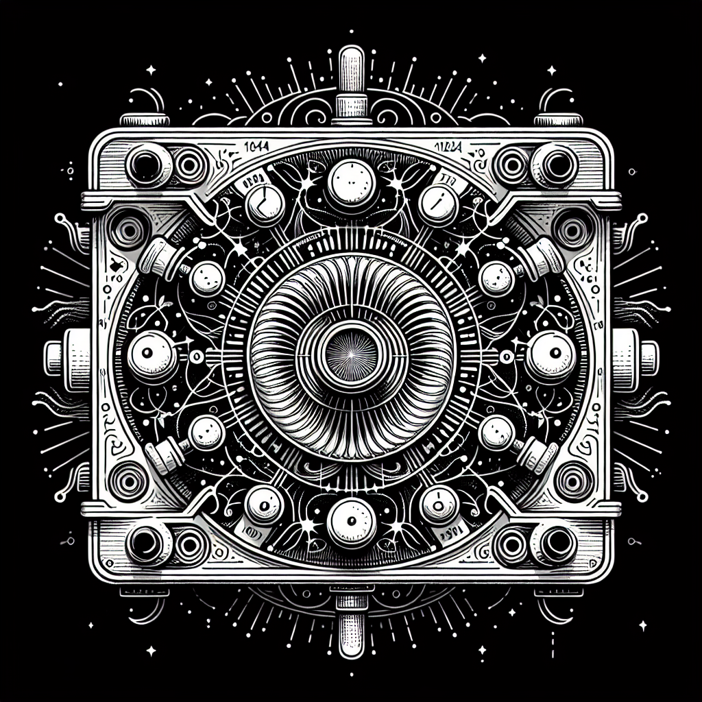

# Synth Generator Plugin

A [Signals & Sorcery](https://signalsandsorcery.com) plugin that generates AI-powered MIDI patterns with Surge XT synthesis.

<p align="center">
  
</p>

> Part of the **[Signals & Sorcery](https://signalsandsorcery.com)** ecosystem.

## What it does

- Creates MIDI tracks with AI-generated patterns (basslines, chords, leads, pads, arpeggios)
- Loads Surge XT presets automatically based on track role
- Supports shuffle, duplicate, and per-track prompt customization
- FX chain with 6 categories (EQ, compressor, chorus, phaser, delay, reverb)
- Instrument browser for swapping VST3/AU synths

## Install

From within Signals & Sorcery: **Settings > Manage Plugins > Add Plugin** and enter:

```
https://github.com/shiehn/sas-synth-plugin
```

Or clone manually into `~/.signals-and-sorcery/plugins/@signalsandsorcery/synth-generator/`.

## Capabilities

| Capability | Required |
|------------|----------|
| `requiresLLM` | Yes - AI MIDI generation |
| `requiresSurgeXT` | Yes - synth preset loading |

## Development

Built with the [@signalsandsorcery/plugin-sdk](https://github.com/shiehn/sas-plugin-sdk). See the [Plugin SDK docs](https://signalsandsorcery.com/plugin-sdk/) for the full API reference.

## The Signals & Sorcery Ecosystem

- **[Signals & Sorcery](https://signalsandsorcery.com)** — the flagship AI music production workstation
- **[sas-plugin-sdk](https://github.com/shiehn/sas-plugin-sdk)** — TypeScript SDK for building generator plugins
- **[sas-sample-plugin](https://github.com/shiehn/sas-sample-plugin)** — Sample library browser with time-stretching
- **[sas-audio-plugin](https://github.com/shiehn/sas-audio-plugin)** — AI audio texture generation
- **[DeclarAgent](https://github.com/shiehn/DeclarAgent)** — Declarative agent + MCP transport for S&S

<p align="center">
  <a href="https://signalsandsorcery.com">signalsandsorcery.com</a>
</p>

## License

MIT
